# QuizzApp Tutorial - Complete Guide for Non-Technical Users

Welcome to QuizzApp! This tutorial will guide you through every step of using the quiz application, from logging in as an admin to viewing results.

**Live Application:** https://quizzapp-vercel.vercel.app/

---

## Table of Contents
1. [Getting Started - Admin Login](#1-getting-started---admin-login)
2. [Creating Quiz Templates](#2-creating-quiz-templates)
3. [Adding Questions to Templates](#3-adding-questions-to-templates)
4. [Starting Quiz Sessions](#4-starting-quiz-sessions)
5. [Managing Sessions](#5-managing-sessions)
6. [Viewing Results](#6-viewing-results)
7. [Participant Experience](#7-participant-experience)

---

## 1. Getting Started - Admin Login

### How to Access the Admin Panel

1. **Open your web browser** (Chrome, Firefox, Safari, or Edge)
2. **Navigate to:** https://quizzapp-vercel.vercel.app/admin/login
3. You'll see a login form with two fields:
   - **Username:** Enter your admin username (provided by the host)
   - **Password:** Enter your admin password (provided by the host)
4. **Click the "Login" button**
5. Upon successful login, you'll be redirected to the **Admin Dashboard**

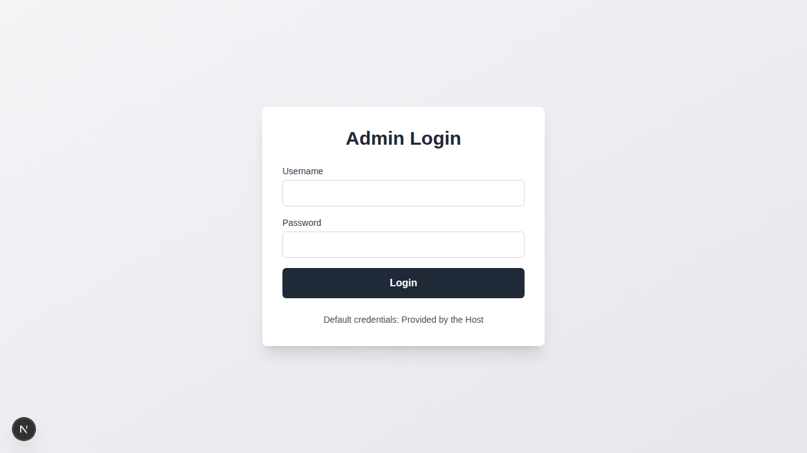
*Screenshot: Admin login page with username and password fields*

### Admin Dashboard Overview

After logging in, you'll see the main admin dashboard with three main options:
- **📝 Manage Templates** - Create and view quiz templates
- **🎯 Manage Sessions** - View and control active quiz sessions
- **🚀 Start New Session** - Quickly start a new quiz session

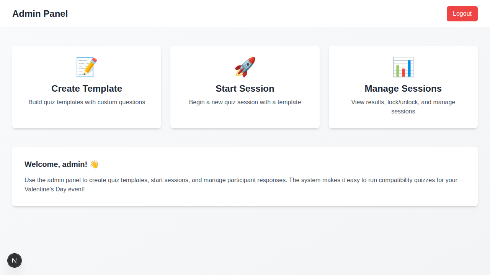
*Screenshot: Admin dashboard showing the three main options for managing templates, sessions, and starting new sessions*

---

## 2. Creating Quiz Templates

Templates are reusable quiz structures that contain questions. You can use the same template multiple times for different sessions.

### Step-by-Step: Create a New Template

1. **From the Admin Dashboard**, click **"Manage Templates"**
2. Click the **"+ Create New Template"** button (blue button on the right)
3. You'll be taken to the **Create Template** page

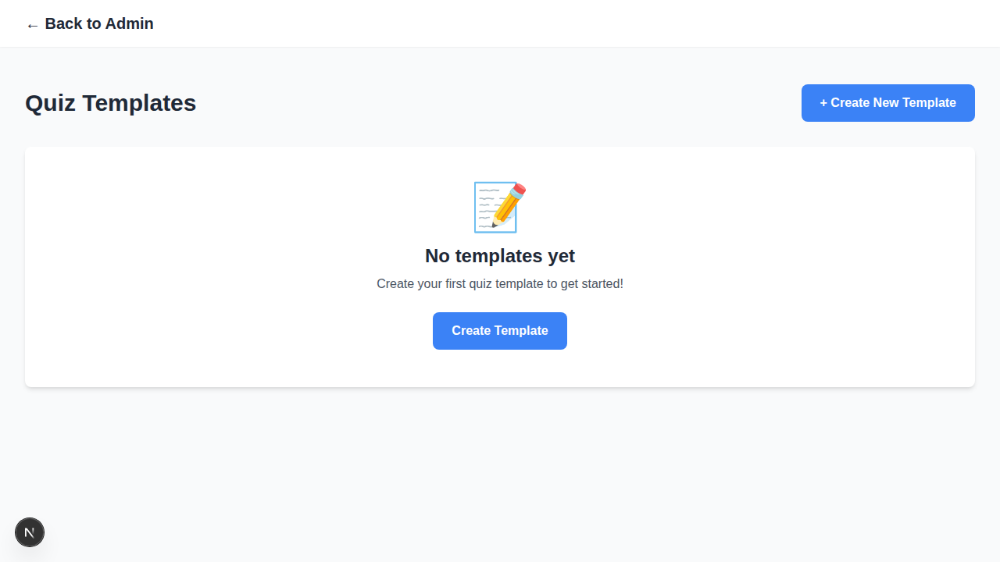
*Screenshot: Templates list page showing the "Create New Template" button*

### Fill in Template Information

1. **Template Name** (Required)
   - Enter a descriptive name for your quiz
   - Example: "Valentine's Day Compatibility Quiz"
   - Example: "Product Knowledge Test"

2. **Template Description** (Optional)
   - Add a brief description of what this quiz is about
   - This will be shown to participants before they start
   - Example: "Find out how compatible you are with your partner!"

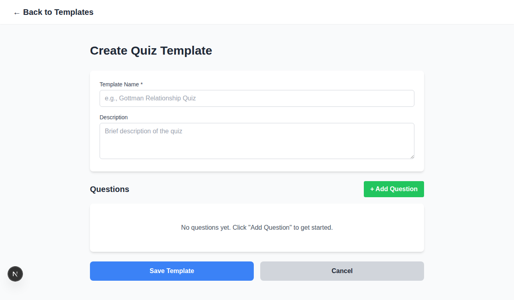
*Screenshot: Empty create template form showing template name and description fields*

---

## 3. Adding Questions to Templates

QuizzApp supports **three types of questions**. You can mix and match these types in your template.

### Adding Your First Question

1. After filling in the template name and description, click **"+ Add Question"**
2. A new question card will appear

### Question Type 1: Text Answer

**Best for:** Open-ended responses, short answers, or long-form text

**How to create:**
1. In the **"Question Text"** field, type your question
   - Example: "What do you love most about your partner?"
2. In the **"Question Type"** dropdown, select **"Text Answer"**
3. Check **"Required"** if participants must answer this question
4. That's it! Text questions don't need options

### Question Type 2: Dropdown (Single Choice)

**Best for:** Selecting one option from a list where you want to save space

**How to create:**
1. Type your question in the **"Question Text"** field
   - Example: "What is your favorite color?"
2. Select **"Dropdown (Single Choice)"** from the **"Question Type"** dropdown
3. **Add Options:**
   - Click **"+ Add Option"**
   - Type the first option (e.g., "Red")
   - Click **"+ Add Option"** again for each additional option
   - Add as many options as you need (e.g., "Blue", "Green", "Yellow")
4. To remove an option, click the **"Remove"** button next to it
5. Check **"Required"** if needed

### Question Type 3: Radio (Multiple Choice)

**Best for:** Selecting one option from a list with all options visible

**How to create:**
1. Type your question in the **"Question Text"** field
   - Example: "How often do you go on dates?"
2. Select **"Radio (Multiple Choice)"** from the **"Question Type"** dropdown
3. **Add Options:** (same as dropdown)
   - Click **"+ Add Option"**
   - Type each option (e.g., "Once a week", "Once a month", "Rarely")
   - Click **"+ Add Option"** for more options
4. Check **"Required"** if participants must answer

### Managing Questions

**Reordering Questions:**
- Use the **↑ Move Up** button to move a question higher
- Use the **↓ Move Down** button to move a question lower

**Removing Questions:**
- Click the **🗑️ Delete** button to remove a question

**Adding More Questions:**
- Click **"+ Add Question"** at the bottom to add another question
- Add as many questions as you need!

### Saving Your Template

1. Once you've added all your questions, scroll to the bottom
2. Click the **"💾 Create Template"** button (green button)
3. You'll be redirected to the **Templates** page
4. Your new template will appear in the list

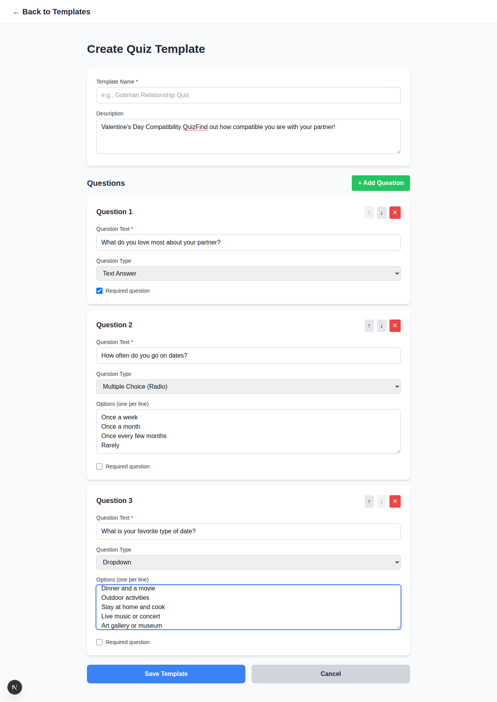
*Screenshot: Template form filled with sample questions showing all three question types (Text, Radio, and Dropdown)*

### Viewing a Template

1. From the **Templates** page, find your template
2. Click the **"View"** button
3. You'll see:
   - Template name and description
   - Number of questions
   - Number of sessions using this template
   - All questions with their types and options
4. From here, you can also click **"🚀 Start Session with this Template"**

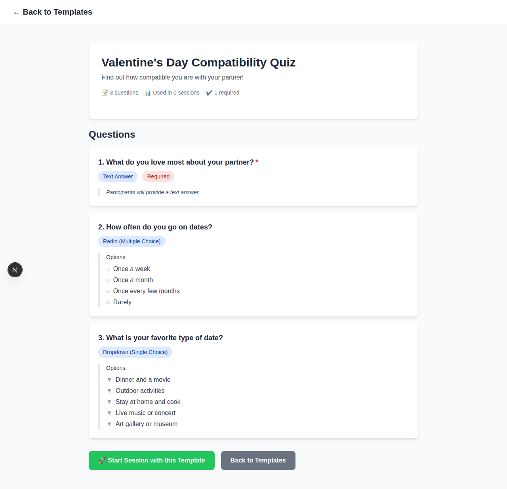
*Screenshot: Template view showing all questions with their types and options*

---

## 4. Starting Quiz Sessions

A **session** is a live instance of a quiz that participants can join. Each session gets a unique 4-character code.

### Method 1: Start from Admin Dashboard

1. Go to the **Admin Dashboard**
2. Click **"🚀 Start New Session"**
3. Continue to [Configure Session](#configure-your-session)

### Method 2: Start from Templates Page

1. Go to **"Manage Templates"**
2. Click **"View"** on the template you want to use
3. Click **"🚀 Start Session with this Template"**
4. Continue to [Configure Session](#configure-your-session)

### Configure Your Session

1. **Select Template** (Required)
   - Choose which quiz template to use from the dropdown
   - You'll see the number of questions in each template

2. **Time Limit** (Optional)
   - Enter a number in minutes
   - Example: "10" means participants have 10 minutes to complete the quiz
   - Leave empty for no time limit
   - Note: The timer starts when the participant clicks "Start Quiz"

3. **Scheduled Unlock Time** (Optional)
   - Click the date/time field
   - Choose a future date and time
   - The quiz will automatically unlock at this time
   - Leave empty to unlock the session immediately

### Understanding Session Status

- **Unlocked** (Green): Participants can join and take the quiz
- **Locked** (Red): Session exists but participants cannot submit responses
- **Completed** (Gray): Session is finished and archived

4. **Review the summary** showing what your session will include
5. Click **"🚀 Start Session"** (green button)
6. You'll be taken to the **Session Details** page

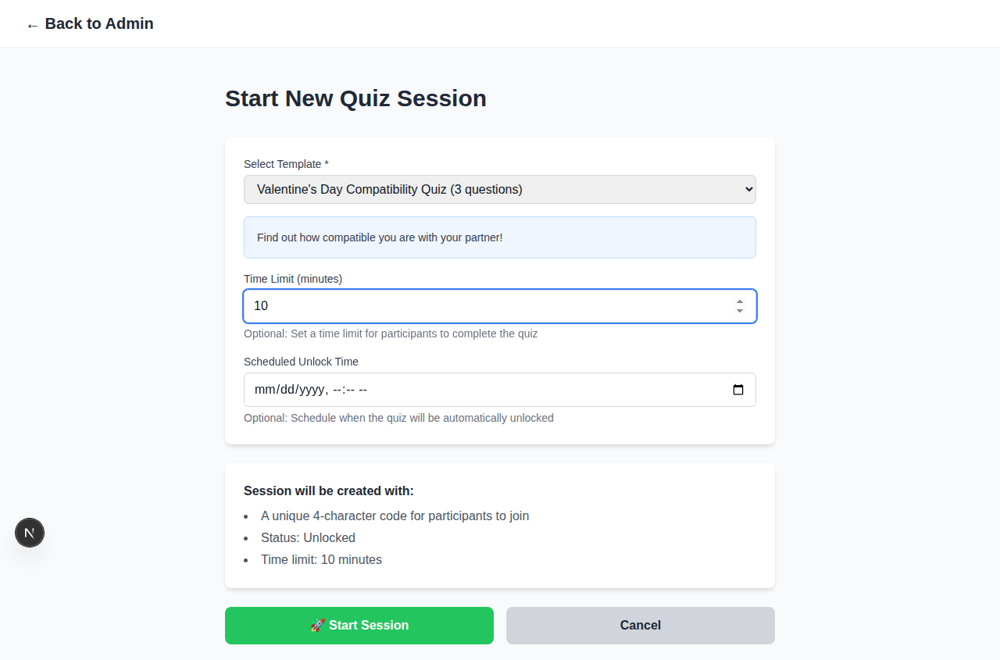
*Screenshot: Start session page showing template selection, time limit, and scheduled unlock time options*

---

## 5. Managing Sessions

### Viewing All Sessions

1. From the **Admin Dashboard**, click **"Manage Sessions"**
2. You'll see all your sessions with:
   - Session code (4 characters)
   - Template name
   - Current status (Locked/Unlocked/Completed)
   - Number of responses received
   - Creation date

3. Click **"View Details"** on any session to manage it

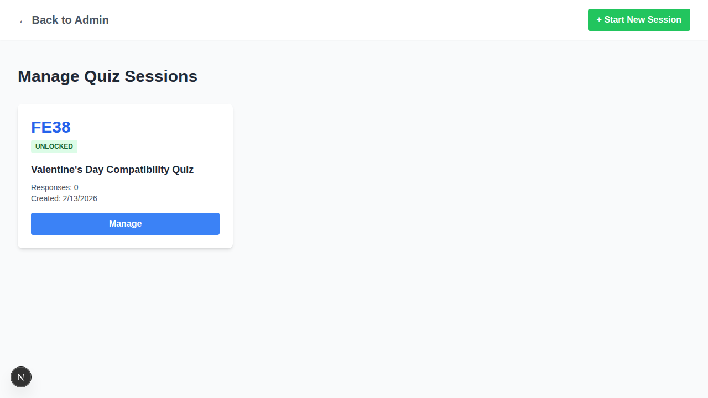
*Screenshot: Sessions list page showing all active quiz sessions with their codes and status*

### Session Details Page

When you open a session, you'll see:

**Left Side - Session Information:**
- **Join Code:** The 4-character code participants need
- **Status:** Current session status
- **Copy Join Link:** Click to copy the participant join URL
- Questions count, responses count, time limit
- Creation and unlock times

**Right Side - Session Controls:**
- **🔓 Unlock Session:** Allow participants to take the quiz
- **🔒 Lock Session:** Prevent new submissions
- **✓ Mark as Completed:** Archive the session

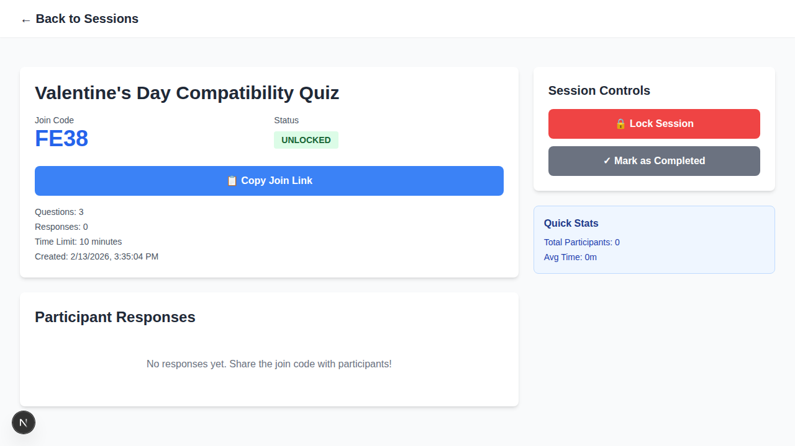
*Screenshot: Session details page showing join code, status, controls, and participant responses*

### Sharing the Quiz with Participants

**Option 1: Share the Code**
1. Tell participants to go to: https://quizzapp-vercel.vercel.app/join
2. Give them the 4-character code
3. They enter the code and click "Join Quiz"

**Option 2: Share the Direct Link**
1. On the Session Details page, click **"📋 Copy Join Link"**
2. Share this link via email, messaging apps, or social media
3. Participants can click the link and start immediately

### Controlling Session Access

**To Start Accepting Responses:**
1. Make sure the session status is **"Unlocked"** (green)
2. If it's locked, click **"🔓 Unlock Session"**

**To Stop Accepting Responses:**
1. Click **"🔒 Lock Session"**
2. Participants will see that the quiz is locked
3. You can unlock it again later if needed

**To Complete a Session:**
1. Click **"✓ Mark as Completed"**
2. This closes the session permanently
3. Use this when you're done collecting responses

---

## 6. Viewing Results

### Real-Time Results

Results appear immediately after each participant submits their quiz. The Session Details page updates automatically.

### Understanding the Results View

On the **Session Details** page, scroll down to see **"Participant Responses"**

**For Each Response, You'll See:**

1. **Participant Information:**
   - Full name (required)
   - Email address (if provided)
   - Phone number (if provided)

2. **Submission Details:**
   - Date and time of submission
   - Total time spent on the quiz (minutes and seconds)

3. **All Answers:**
   - Each question is shown with the participant's answer
   - Format: "Q1: [Question text]" followed by the answer
   - If a question wasn't answered, it shows "(No answer)"

### Quick Stats

Look at the **"Quick Stats"** box on the right side:
- **Total Participants:** How many people completed the quiz
- **Avg Time:** Average time spent by participants

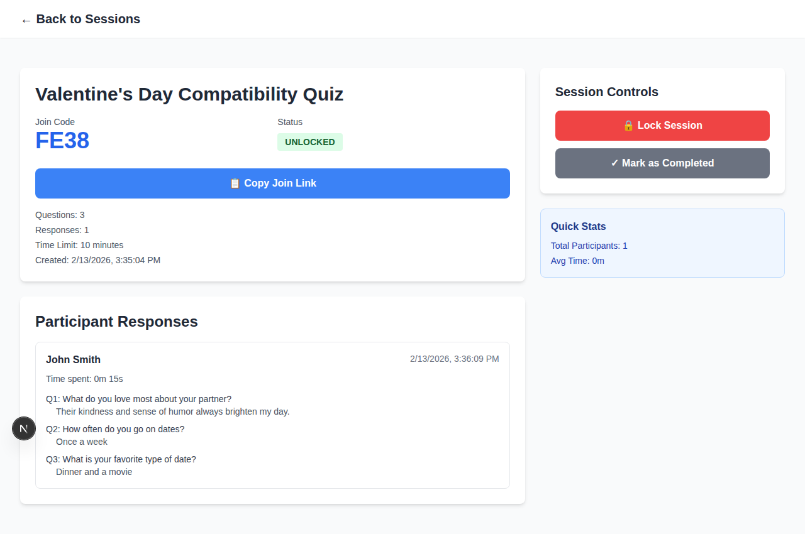
*Screenshot: Session details page with participant responses showing answers to all questions*

### Exporting Results

Currently, results are displayed on the screen. To save them:

**Manual Method:**
1. Take screenshots of the responses
2. Or copy and paste the information into a document

**Browser Print Method:**
1. Press `Ctrl+P` (Windows) or `Cmd+P` (Mac)
2. Choose "Save as PDF"
3. This saves the entire page including all responses

---

## 7. Participant Experience

Understanding what participants see helps you create better quizzes and provide support.

### Step 1: Joining the Quiz

Participants can join in two ways:

**Method A: Using the Code**
1. Go to https://quizzapp-vercel.vercel.app/join
2. Enter the 4-character code
3. Click "Join Quiz"

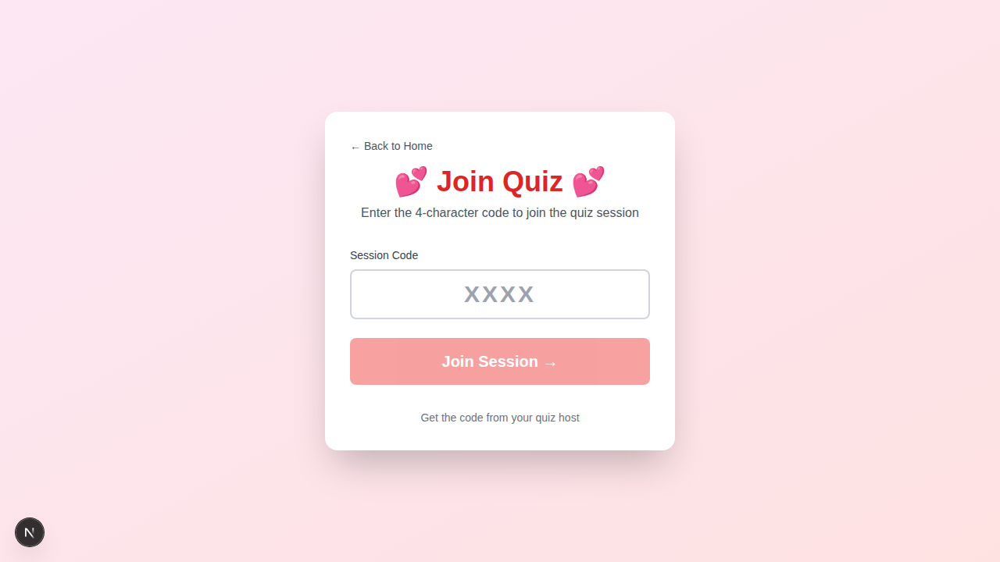
*Screenshot: Participant join page where users enter the 4-character session code*

**Method B: Using the Direct Link**
1. Click the link you shared
2. Goes directly to the quiz

### Step 2: Entering Information

Before starting, participants must enter:
- **Name** (Required) - Must provide their full name
- **Email** (Optional) - Can skip if they prefer
- **Phone Number** (Optional) - New field for contact information

They also see:
- Quiz name and description
- Number of questions
- Time limit (if any)
- How many questions are required

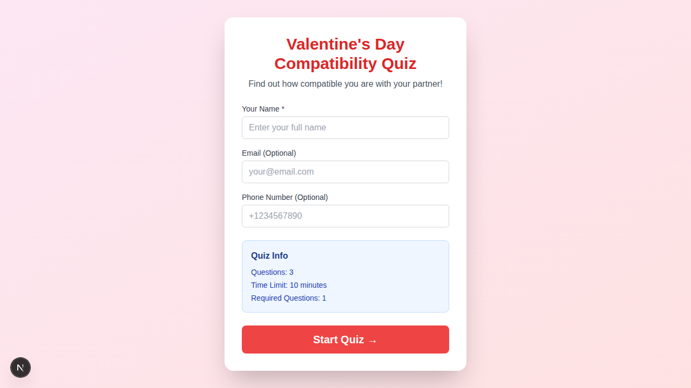
*Screenshot: Participant information page showing name, email, and phone fields, along with quiz details*

### Step 3: Starting the Quiz

1. Click **"Start Quiz →"** button
2. Timer starts (if time limit is set)
3. All questions appear on one page

### Step 4: Answering Questions

**Text Questions:**
- Type the answer in the text box

**Dropdown Questions:**
- Click the dropdown and select one option

**Radio Questions:**
- Click one of the radio buttons

**Required Questions:**
- Marked with a red asterisk (*)
- Must be answered before submitting

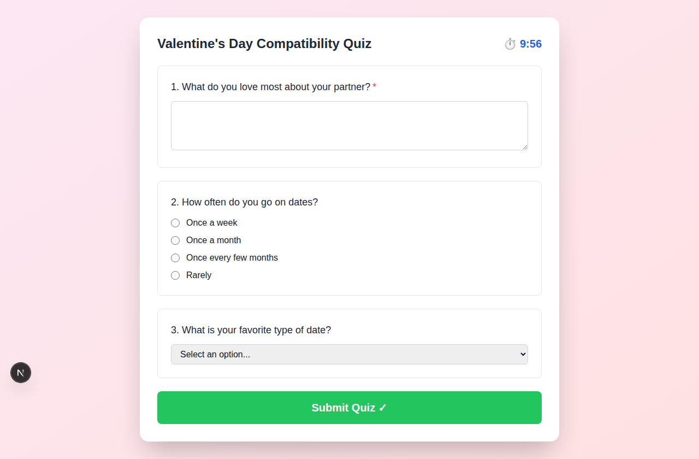
*Screenshot: Quiz interface showing all three question types with a countdown timer at the top*

### Step 5: Submitting

1. After answering all questions, click **"Submit Quiz ✓"**
2. System checks that all required questions are answered
3. If any required questions are missing, an alert appears
4. Upon successful submission, they see a "Thank You" page

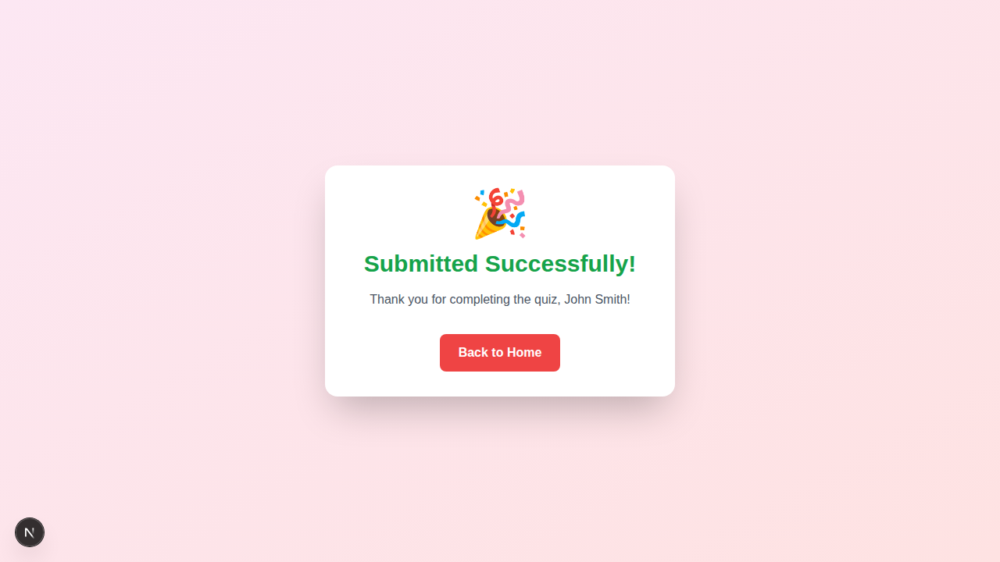
*Screenshot: Success page shown to participants after quiz submission*

### If Time Runs Out

- Quiz automatically submits
- If required questions are unanswered, participant gets an alert
- They must complete required questions before time expires

### If Session is Locked

- Participants see a "🔒 Quiz Locked" message
- If an unlock time is scheduled, they see a countdown
- Page checks every 30 seconds for status updates
- Once unlocked, they can start the quiz

---

## Tips for Success

### Creating Great Templates

1. **Use Clear Question Text**
   - Ask one thing at a time
   - Avoid confusing or complex language
   - Example: Good: "What's your favorite food?"
   - Example: Bad: "Tell me about your preferences regarding culinary items"

2. **Choose the Right Question Type**
   - Use **Text** for opinions, explanations, or when you want detailed answers
   - Use **Dropdown** when you have many options and want to save space
   - Use **Radio** when you have 2-5 options and want them all visible

3. **Set Appropriate Requirements**
   - Mark questions as required only if you truly need them
   - Having too many required questions can frustrate participants

4. **Test Your Template**
   - Create a test session and take the quiz yourself
   - Check if questions make sense and options are clear
   - Adjust before sharing with real participants

### Managing Sessions Effectively

1. **Use Time Limits Wisely**
   - For quick polls: 2-5 minutes
   - For standard quizzes: 10-15 minutes
   - For detailed surveys: 20+ minutes or no limit

2. **Schedule Unlock Times**
   - Perfect for events starting at specific times
   - Example: Unlock quiz when your event begins
   - System unlocks automatically, no need to do it manually

3. **Communicate Clearly**
   - Tell participants exactly where to go
   - Share the code OR the link (not both to avoid confusion)
   - Let them know if there's a time limit

4. **Monitor in Real-Time**
   - Keep the Session Details page open during your event
   - Watch responses come in live
   - Lock the session when you're ready to stop

### Troubleshooting Common Issues

**"I forgot my admin password"**
- Contact the system administrator/host who set up your account

**"Participants say the quiz is locked"**
- Check the session status on the Session Details page
- Click "🔓 Unlock Session" if it's locked
- Check if a scheduled unlock time is set for the future

**"I can't see some responses"**
- Refresh the page
- Responses appear in real-time but may need a refresh
- Make sure you're looking at the correct session

**"I want to edit a template"**
- Currently, templates cannot be edited after creation
- Create a new template with the changes
- Previous sessions using the old template are unaffected

**"Can I delete a session?"**
- Currently, sessions cannot be deleted
- Mark them as "Completed" to archive them
- They'll still appear in your sessions list

**"Participant closed the browser accidentally"**
- If they return using the same code/link with the same name
- They'll start fresh (previous progress is lost)
- Advise participants to complete the quiz in one sitting

---

## Quick Reference

### Admin URLs

- **Main Site:** https://quizzapp-vercel.vercel.app/
- **Admin Login:** https://quizzapp-vercel.vercel.app/admin/login
- **Admin Dashboard:** https://quizzapp-vercel.vercel.app/admin
- **Templates:** https://quizzapp-vercel.vercel.app/admin/templates
- **Sessions:** https://quizzapp-vercel.vercel.app/admin/sessions

### Participant URLs

- **Join Page:** https://quizzapp-vercel.vercel.app/join
- **Direct Quiz Link:** https://quizzapp-vercel.vercel.app/quiz/[CODE]
  - Replace [CODE] with the 4-character session code

### Question Types at a Glance

| Type | Best For | Supports Options | Participant Sees |
|------|----------|------------------|------------------|
| **Text** | Open-ended responses | No | Text input box |
| **Dropdown** | Single choice from many options | Yes | Dropdown menu |
| **Radio** | Single choice from few options | Yes | Radio buttons |

### Session Status Guide

| Status | Meaning | What Participants Can Do |
|--------|---------|--------------------------|
| **Locked** | Session exists but closed | Cannot submit responses |
| **Unlocked** | Session is open | Can take the quiz |
| **Completed** | Session finished | Cannot access |

---

## Need More Help?

If you encounter any issues not covered in this tutorial:

1. **Check the session status** - Make sure it's unlocked
2. **Refresh your browser** - Sometimes a simple refresh helps
3. **Try a different browser** - Chrome, Firefox, Safari, or Edge
4. **Clear your browser cache** - Old data might cause issues
5. **Contact your system administrator** - For login or technical issues

---

## Summary Workflow

Here's the complete process from start to finish:

1. **Login** → https://quizzapp-vercel.vercel.app/admin/login
2. **Create Template** → Add questions (text, dropdown, or radio)
3. **Start Session** → Choose template, set time limit, schedule unlock
4. **Share with Participants** → Give them the code or link
5. **Unlock Session** → Allow participants to begin
6. **Monitor Responses** → Watch results come in real-time
7. **Lock/Complete Session** → When finished collecting responses
8. **Review Results** → View all participant answers and statistics

---

**Congratulations!** You now know how to use QuizzApp from start to finish. Create engaging quizzes and collect responses with ease!

For the best experience, use a modern browser (Chrome, Firefox, Safari, or Edge) and ensure you have a stable internet connection.

Happy quizzing! 🎉
